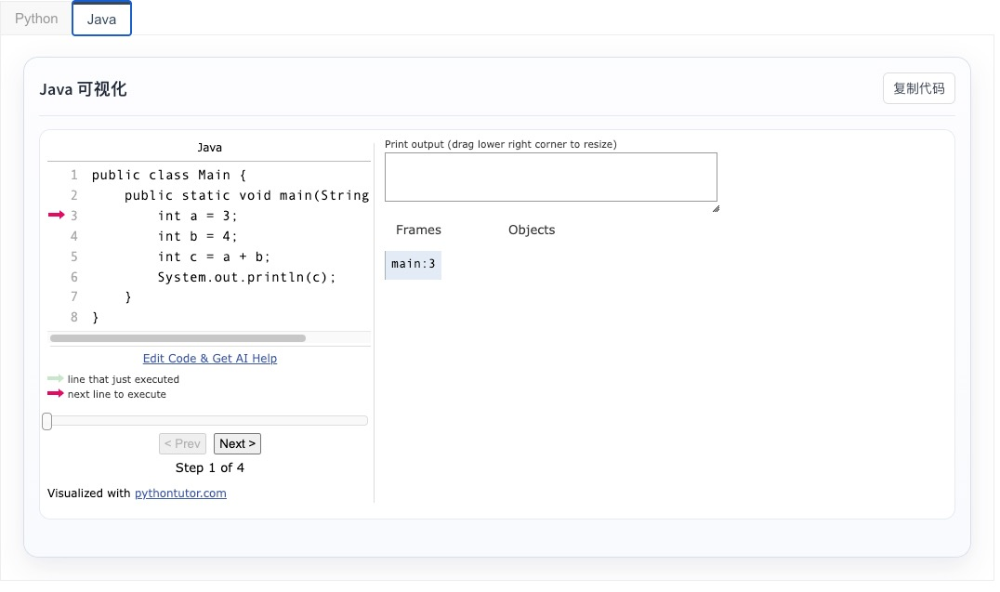
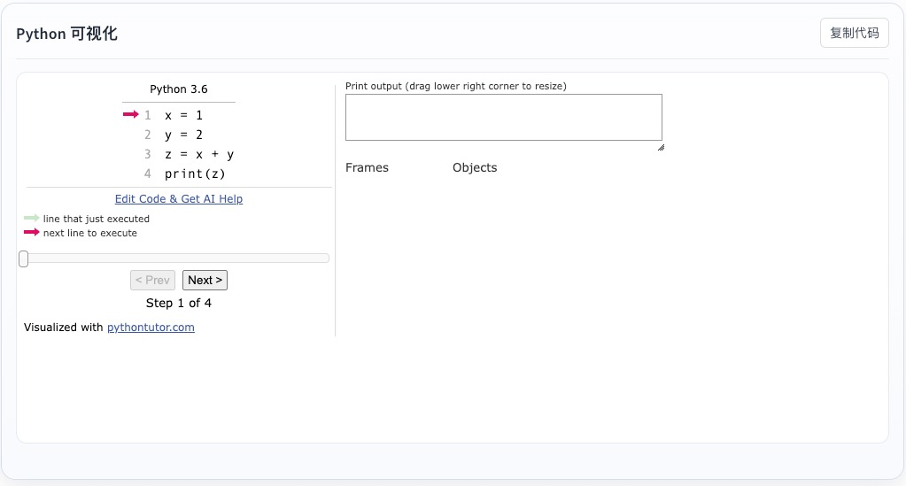

# docsify-pytutor

一个可直接在 **Docsify** 中使用的代码执行可视化插件，基于 **Python Tutor** 实现，支持在 Markdown 中把 `Python` 和 `Java` 代码块自动渲染为可交互的可视化面板。

---

## 使用样例



## 功能特性

- 支持 `python` 代码块执行可视化
- 支持 `java` 代码块执行可视化
- 支持 `pytutor` 作为 Python 简写
- 自动注入样式，无需手动编写大段 CSS
- 自带“复制代码”按钮
- 支持通过 `window.$docsify.pytutor` 进行简单配置
- 支持本地引用
- 支持通过 **GitHub + jsDelivr CDN** 直接引用

---

## 仓库地址

```text
https://github.com/sherlockmen/docsify-pytutor
````

---

## 安装方式

### 方式一：通过 CDN 引用（推荐）
引用以下CDN地址进入`docsify`的`index.html`文件中
```html
<script src="https://cdn.jsdelivr.net/gh/sherlockmen/docsify-pytutor@v1.0.0/dist/docsify-pytutor.js"></script>
```

> 不建议在正式生产环境长期使用分支引用，建议改为固定版本号引用。

### 方式二：本地引用

将插件文件下载到项目中后，本地引入：

```html
<script src="./dist/docsify-pytutor.js"></script>
```

---

## 快速开始

在 Docsify 的 `index.html` 中进行如下配置：

```html
<!DOCTYPE html>
<html lang="zh-CN">
<head>
  <meta charset="UTF-8" />
  <title>Docsify PyTutor Demo</title>
  <meta name="viewport" content="width=device-width, initial-scale=1.0" />
  <link rel="stylesheet" href="//cdn.jsdelivr.net/npm/docsify@4/lib/themes/vue.css" />
</head>
<body>
  <div id="app"></div>

  <script>
    window.$docsify = {
      name: 'Docsify PyTutor Demo',
      loadSidebar: false,
      subMaxLevel: 2,
      pytutor: {
        baseEmbedUrl: 'https://pythontutor.com/iframe-embed.html',
        defaultOptions: {
          cumulative: 'false',
          curInstr: '0',
          heapPrimitives: 'nevernest',
          drawParentPointers: 'false',
          textReferences: 'false',
          showOnlyOutputs: 'false'
        },
        ui: {
          copyButtonText: '复制代码',
          copiedButtonText: '已复制',
          copyFailedText: '复制失败',
          showNote: false,
          noteText: '说明：适合小段教学示例代码，不适合复杂项目代码。',
          maxWidth: '960px',
          aspectRatio: '2.35 / 1',
          minHeight: '400px',
          maxHeight: '500px'
        }
      }
    };
  </script>

  <script src="//cdn.jsdelivr.net/npm/docsify@4"></script>

  <!-- 推荐：固定版本 -->
  <script src="https://cdn.jsdelivr.net/gh/sherlockmen/docsify-pytutor@v1.0.0/dist/docsify-pytutor.js"></script>
</body>
</html>
```

---

## Markdown 使用方式

### Python

````md
```pytutor-python
x = 1
y = 2
z = x + y
print(z)
```
````

### Python 简写

````md
```pytutor
nums = [1, 2, 3]
for n in nums:
    print(n)
```
````

### Java

````md
```pytutor-java
public class Main {
    public static void main(String[] args) {
        int a = 3;
        int b = 4;
        int c = a + b;
        System.out.println(c);
    }
}
```
````

---

## 配置项说明

可以在 `window.$docsify.pytutor` 中进行自定义配置：

```js
window.$docsify = {
  pytutor: {
    baseEmbedUrl: 'https://pythontutor.com/iframe-embed.html',
    defaultOptions: {
      cumulative: 'false',
      curInstr: '0',
      heapPrimitives: 'nevernest',
      drawParentPointers: 'false',
      textReferences: 'false',
      showOnlyOutputs: 'false'
    },
    ui: {
      copyButtonText: '复制代码',
      copiedButtonText: '已复制',
      copyFailedText: '复制失败',
      showNote: false,
      noteText: '说明：适合小段教学示例代码，不适合复杂项目代码。',
      maxWidth: '960px',
      aspectRatio: '2.35 / 1',
      minHeight: '400px',
      maxHeight: '500px'
    }
  }
}
```

### 参数说明

#### 顶层配置

| 参数               | 说明                     | 示例                                                   |
| ---------------- | ---------------------- |------------------------------------------------------|
| `baseEmbedUrl`   | Python Tutor iframe 地址 | `https://pythontutor.com/iframe-embed.html` 默认配置无需更改 |
| `defaultOptions` | 透传给 Python Tutor 的参数   | 见下文                                                  |
| `ui`             | 插件界面相关配置               | 见下文                                                  |

#### `defaultOptions` 配置

| 参数                   | 说明           | 默认值         |
| -------------------- | ------------ | ----------- |
| `cumulative`         | 是否累计显示执行步骤   | `false`     |
| `curInstr`           | 初始显示的执行步骤    | `0`         |
| `heapPrimitives`     | 基本类型在堆中的显示方式 | `nevernest` |
| `drawParentPointers` | 是否显示父指针      | `false`     |
| `textReferences`     | 是否显示文本引用     | `false`     |
| `showOnlyOutputs`    | 是否仅显示输出      | `false`     |

#### `ui` 配置

| 参数                 | 说明          | 默认值           |
| ------------------ | ----------- | ------------- |
| `copyButtonText`   | 复制按钮文案      | `复制代码`        |
| `copiedButtonText` | 复制成功文案      | `已复制`         |
| `copyFailedText`   | 复制失败文案      | `复制失败`        |
| `showNote`         | 是否显示底部说明    | `false`       |
| `noteText`         | 底部说明文字      | 适合小段教学示例代码的说明 |
| `maxWidth`         | iframe 最大宽度 | `960px`       |
| `aspectRatio`      | iframe 显示比例 | `2.35 / 1`    |
| `minHeight`        | iframe 最小高度 | `400px`       |
| `maxHeight`        | iframe 最大高度 | `500px`       |

---
## License

MIT
