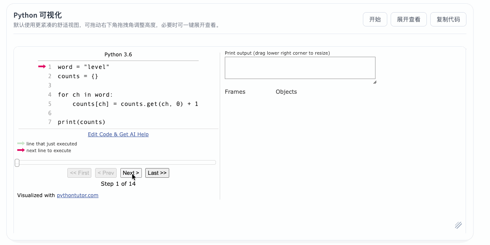
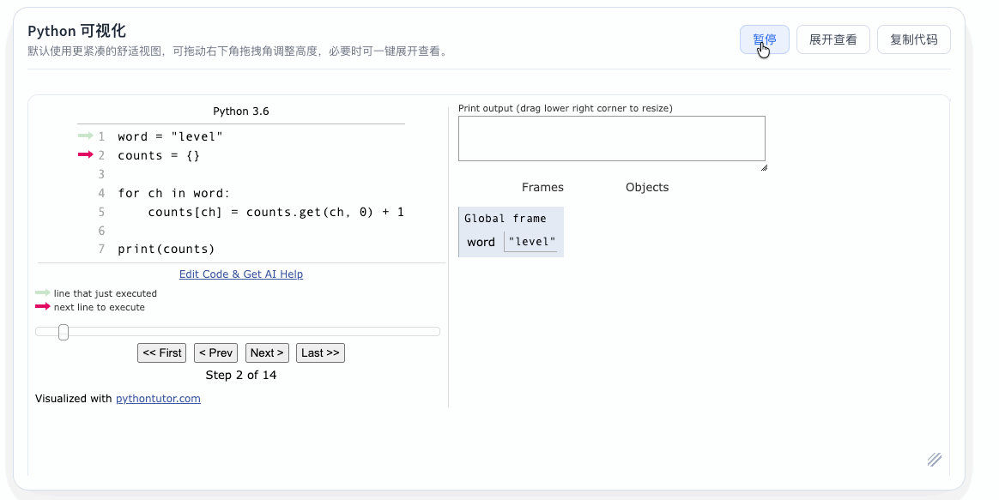
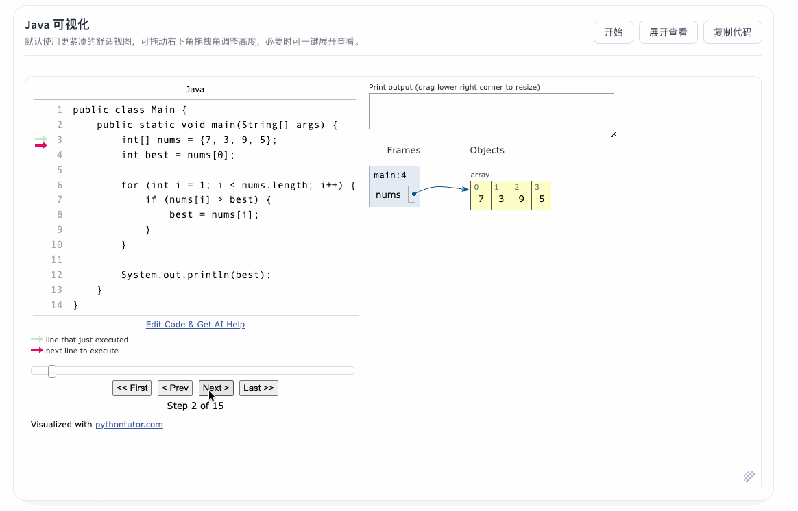
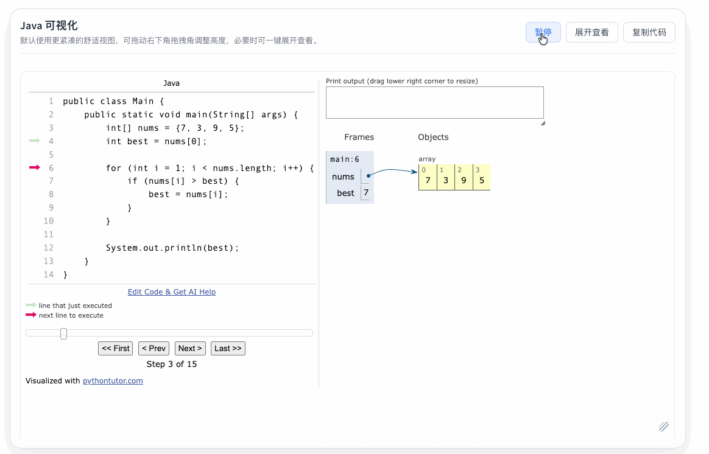

# docsify-pytutor

一个可直接在 **Docsify** 中使用的代码执行可视化插件，基于 **Python Tutor** 实现，支持在 Markdown 中把 `Python` 和 `Java` 代码块自动渲染为可交互的可视化面板。

---

## 功能特性

- 支持 `python` 代码块可视化交互展示
- 支持 `java` 代码块可视化交互展示
- 支持 `pytutor` 作为 Python 简写
- 自动注入样式，无需手动编写大段 CSS
- 自带“复制代码”按钮
- 支持通过 `window.$docsify.pytutor` 进行简单配置
- 支持本地引用
- 支持通过 **GitHub + jsDelivr CDN** 直接引用
- 内置 `compact / comfortable / tall` 三档舒适视图
- 支持一键“展开查看”，适合长代码和复杂对象场景
- 窄屏下可自动切换为纵向布局，减少对象区被压缩
- 支持右下角拖拽角手动调整可视化面板高度
- 自动去除代码块的公共前导缩进，降低 Markdown 缩进带来的报错概率
- 自动识别每个代码块的真实执行步数，支持“开始 / 暂停”自动播放

---

## 效果预览

下面这一段会被插件直接渲染成可交互面板，不会显示原始 Markdown 围栏。

### Python 直接渲染预览
```pytutor
word = "level"
counts = {}

for ch in word:
    counts[ch] = counts.get(ch, 0) + 1

print(counts)
```


#### Python 步骤执行动图

#### Python 自动执行动图


### Java 直接渲染预览
```pytutor-java
public class Main {
    public static void main(String[] args) {
        int[] nums = {7, 3, 9, 5};
        int best = nums[0];

        for (int i = 1; i < nums.length; i++) {
            if (nums[i] > best) {
                best = nums[i];
            }
        }

        System.out.println(best);
    }
}
```

#### Java 步骤执行动图

#### Java 自动执行动图


---

## 仓库地址

```text
https://github.com/sherlockmen/docsify-pytutor
```

---

## 安装方式

### 方式一：通过 CDN 引用（推荐）

在`docsify`的`index.html`文件中引用以下CDN地址

```html
<script src="https://cdn.jsdelivr.net/gh/sherlockmen/docsify-pytutor@v2.0.0/dist/docsify-pytutor.js"></script>
```

### 方式二：本地引用

将插件文件下载到项目中后，本地引入：

```html
<script src="./dist/docsify-pytutor.js"></script>
```
---

## 快速开始

在 Docsify 的 `index.html` 中进行如下配置：

```html
<!DOCTYPE html>
<html lang="zh-CN">
<head>
  <meta charset="UTF-8" />
  <title>Docsify PyTutor Demo</title>
  <meta name="viewport" content="width=device-width, initial-scale=1.0" />
  <link rel="stylesheet" href="//cdn.jsdelivr.net/npm/docsify@4/lib/themes/vue.css" />
</head>
<body>
  <div id="app"></div>

  <script>
    window.$docsify = {
      name: 'Docsify PyTutor Demo',
      loadSidebar: false,
      subMaxLevel: 2,
      pytutor: {
        autoplayInterval: 900
      }
    };
  </script>

  <script src="//cdn.jsdelivr.net/npm/docsify@4"></script>
  <script src="https://cdn.jsdelivr.net/gh/sherlockmen/docsify-pytutor@v1.0.1/dist/docsify-pytutor.js"></script>
</body>
</html>
```

---

## Markdown 原始写法示例

下面这一节只展示 Markdown 应该怎么写，所以会以原始代码块形式显示，右上角通常会看到 `md` 标识，这一段是预期行为。

### Python

````md
```pytutor-python
scores = [76, 88, 91, 64]
best = scores[0]

for score in scores[1:]:
    if score > best:
        best = score

print(best)
```
````

### Python 简写

````md
```pytutor
word = "hello"
counts = {}

for ch in word:
    counts[ch] = counts.get(ch, 0) + 1

print(counts)
```
````

### Java

````md
```pytutor-java
public class Main {
    public static void main(String[] args) {
        int n = 5;
        int factorial = 1;

        while (n > 1) {
            factorial *= n;
            n--;
        }

        System.out.println(factorial);
    }
}
```
````

---

## 配置项说明

常用场景下通常只需要这 3 个配置项：

```js
window.$docsify = {
  pytutor: {
    heightPreset: 'comfortable',
    showExpandButton: true,
    autoplayInterval: 900
  }
}
```

| 参数 | 说明 | 默认值 |
|------|------|--------|
| `heightPreset` | 舒适视图档位，支持 `compact / comfortable / tall` | `comfortable` |
| `showExpandButton` | 是否显示展开查看按钮 | `true` |
| `autoplayInterval` | 自动播放步进间隔，单位毫秒 | `900` |

如果你需要限制面板最大宽度，还可以额外设置：

```js
window.$docsify = {
  pytutor: {
    maxWidth: '1080px'
  }
}
```

---

## License

MIT
